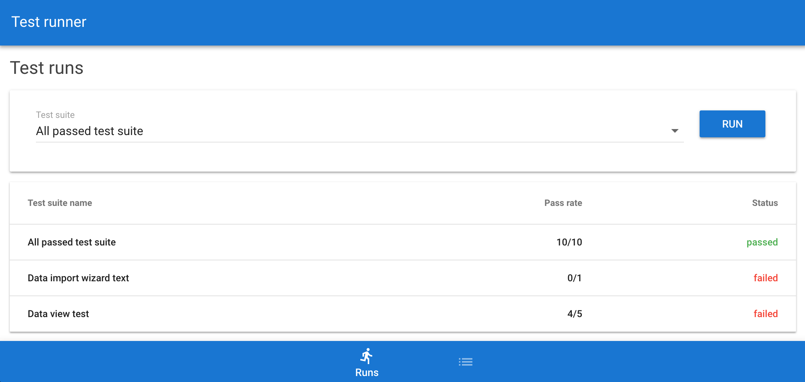
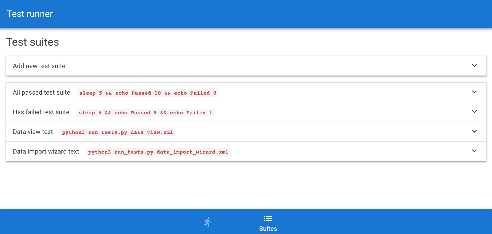

# [Vue.js][vuejs] SPA & [Japronto][japronto] REST server example*
SPA &mdash; single page web application <br/>
REST &mdash; representative state transfer

From the one hand example demonstrates how to make REST server on the
basis of Japronto and Python 3.5+ [asyncio][asyncio]. From the other
hand it can be considered as starting point for learning [Vue.js][vuejs] extended with [Vuex][vuex] and many other front-end stuff like [CoffeeScript][coffee], [Webpack][webpack] and [Pug][pug].





## Getting started
Make sure the following software is installed and is in the PATH.
* [Node.js][nodejs] and [npm][npm]
* Python 3.5 or higher and pip
* [MongoDB][mongo]

Checkout repository and run following commands inside the repo
root. It will install all necessary front-end and back-end dependencies.
```sh
pip install -r requirements.txt
npm install
```
Then build front-end by running
```sh
npm run build
```
Before running Japronto server, first start MongoDB server as
follows or change DB connection string in `server/config.py`
if you have existing MongoDB instance.
```sh
npm run mongo
```
To start Japronto server execute
```sh
npm run dev  # debug environment
npm run prod # production environment
```
by default it will start HTTP server at `localhost:5432`

[vuejs]:    https://github.com/vuejs/vue
[japronto]: https://github.com/squeaky-pl/japronto
[mongo]:    https://github.com/mongodb/mongo
[nodejs]:   https://github.com/nodejs/node
[npm]:      https://github.com/npm/npm
[asyncio]:  https://docs.python.org/3.5/library/asyncio.html
[vuex]:     https://github.com/vuejs/vuex
[coffee]:   http://coffeescript.org
[webpack]:  https://github.com/webpack/webpack
[pug]:      https://github.com/pugjs/pug
